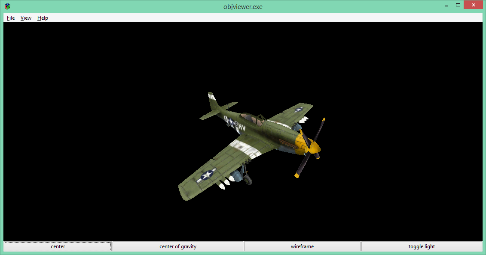
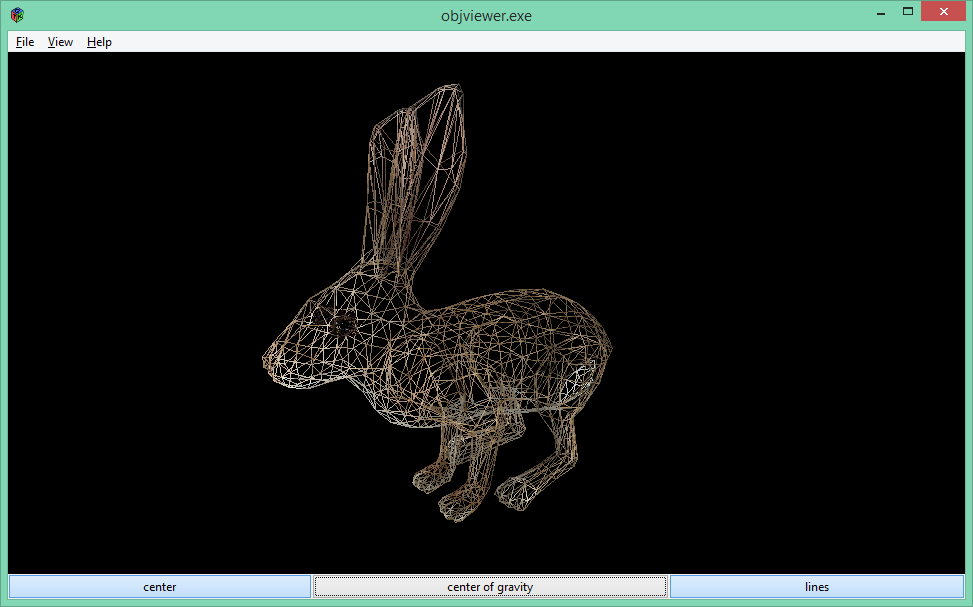

# objviewer
**Description:**
Obj Viewer is a basic Wavefront object file loader made with GTK+2.0, GtkGLExt and OpenGL 1.2

**Features:**
objviewer does not support Mtl files yet. This may come in the future.
Texture files are loaded with GdkPixbuf. The supported file formats are the following :
- bmp
- tga
- jpeg
- png
- tiff
- and more

**Installation:**
To build objviewer, install the following dependencies :
- GNU make
- GTK+ 2
- GtkGLExt

**Notes:**
Maybe I will port this little app to GTK+ 3 and OpenGL 3.3 in the future, but nothing is planed for the moment.
If you have any observation about the code or if you have any bug to report, you can mail me at phm.vilain@gmail.com
If you want to use this code to make a paid software, please let me know.

**Screenshots:**

