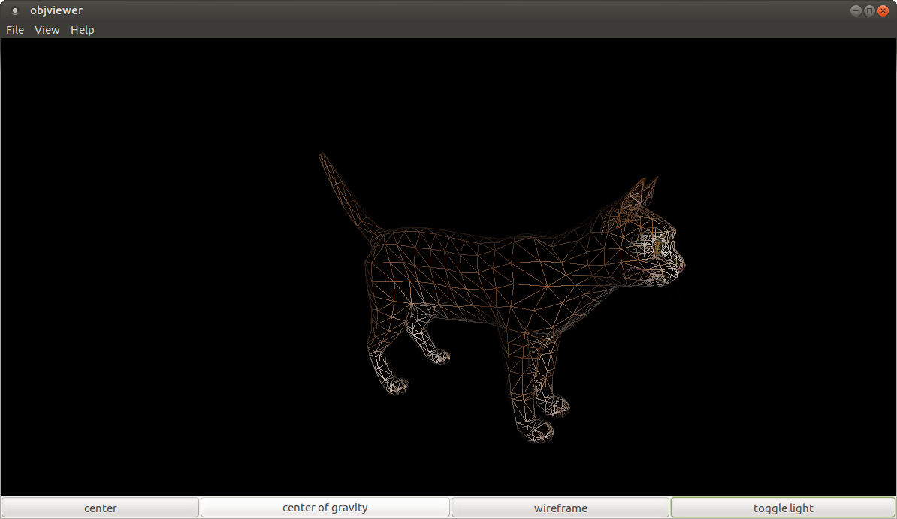

# objviewer
Obj Viewer is a basic Wavefront object file loader made with GTK+2.0, GtkGLExt and OpenGL 1.2


## Features
Obj viewer works fine with a lot of obj files. However, some files contain instructions not supported by this loader. Loading such files may result in a crash of the application.
Here are the instructions not supported
- vp
- l
- bmat
- step
- cstype
- curv
- surf
- deg
- sp
- and more

Some instructions are just ingnored :
- o
- g
- mtllib
- usemtl

And here are the supported features :
- triangular faces
- square faces
- faces defined with absolute indices
- faces defined with relative indices

Note that textured parts and non-textured parts can not cohabit in the same file. The obj files loaded must be fully textured or fully untextured, or else, it will result in a crash.
objviewer does not support Mtl files yet. This may come in the future.

Texture files are loaded with GdkPixbuf. The supported file formats are the following :
- bmp
- tga
- jpeg
- png
- tiff
- and more

## Installation
To build objviewer, install the following dependencies :
- GNU make
- GTK+ 2
- GtkGLExt

Then, Type, "make"

On, Ubuntu/Debian/Mint, you can build it that way :
```
sudo apt-get install libgtkglext1-dev git build-essential
git clone https://github.com/phm97/objviewer.git
cd objviewer
make
```

## license
FreeBSD license

## Notes
Maybe I will port this little app to GTK+ 3 and OpenGL 3.3 in the future, but nothing is planed for the moment.
If you have any observation about the code or if you have any bug to report, you can mail me at phm.vilain@gmail.com

## Screenshots



